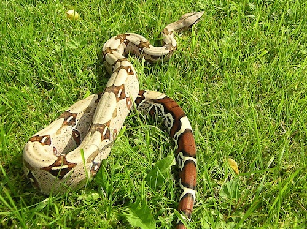
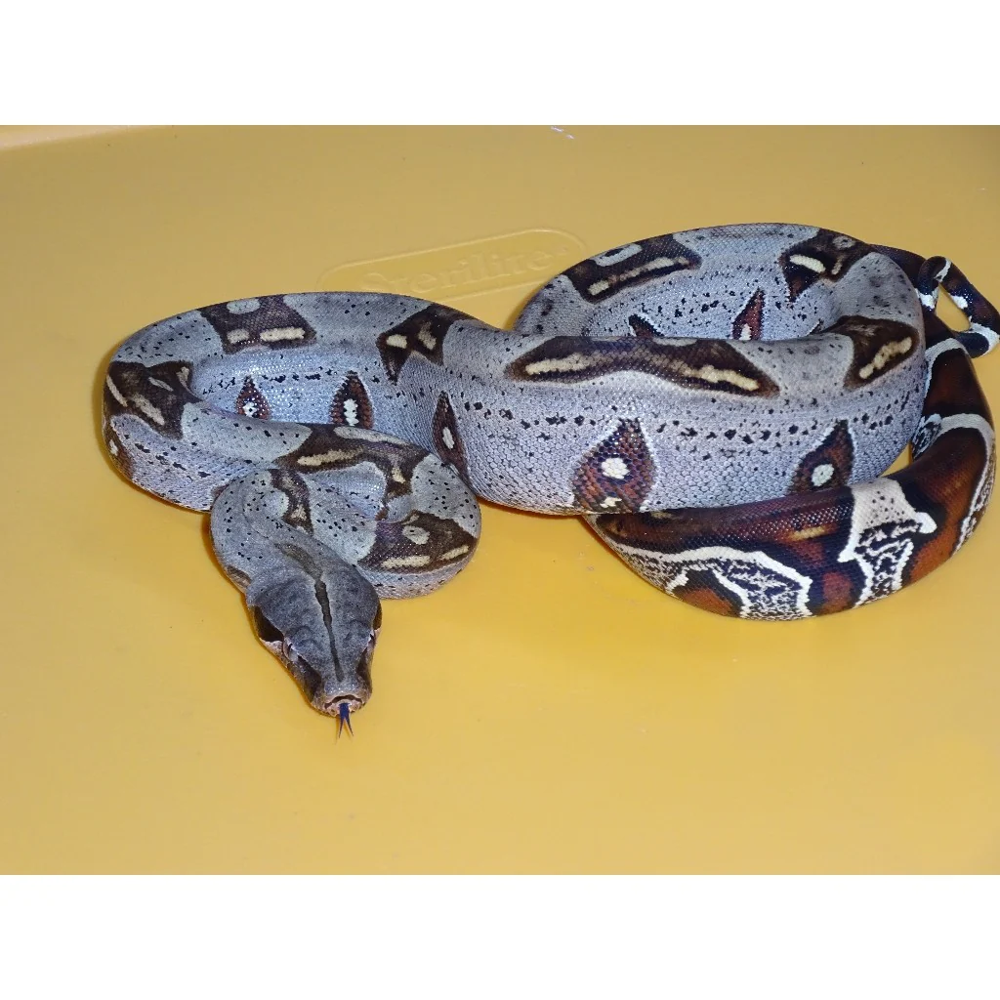

<!DOCTYPE html>
<html>
    <head>
        <title>RedTailBoaCare.com</title>
        <h2 style="font-style: italic;font-size: larger;font-weight: bold;">Red Tail Boa Care Sheet!</h2>
        </head>
        <body>
            <h3>list of <mark>essentials</mark> for your boa!</h3>
            <ol>
                <li>You will need an enclosure: A tank size of <mark>6′ x 2′ x 2′.</mark></li>
                <li>You will need to keep the <mark>hot side temperature of 95-100°F.</mark></li>
                <li>You will need a substrate, <mark>you can use reptile carpet, coconut fiber, or newspaper substrate.</mark></li>
                <li>you will need to <mark>feed</mark> your boa once every <mark>10 to 14 days</mark></li>
                <li>You must <mark>clean</mark> your boa's enclosure at least once a month.</li>
                <li>MUST have humidity between <mark>60 to 80%</mark></li>
            </ol>
            
            
Are you in search of a captivating and unique pet that will leave your friends and family in awe? Look no further than the Red Tail Boas! These stunning constrictors are highly sought after by reptile enthusiasts for their striking red tail markings and availability in a range of color morphs.

                Not only are they visually stunning, but they also make great pets for those who are experienced with reptiles. In this article, we will explore everything you need to know about caring for a Red Tail Boa, from their diet and habitat requirements to their health considerations.
                
                Whether you are a seasoned reptile owner or considering getting your first snake, we will guide you through the ins and outs of Red Tail Boa ownership. So, sit back and prepare to discover why the Red Tail Boa is the perfect pet constrictor for you.Red Tail Boas are popular pet constrictors and come in two subspecies: Red-Tailed and Argentine.
                They require a large custom enclosure, regular feeding and handling, and daily spot cleaning of their cage.
                Their care guidelines include a humidity of 60-80%, a tank size of 6′ x 2′ x 2′, a UVA basking bulb, cypress mulch substrate, and a hot side temperature of 95-100°F.
                When buying a Red Tail Boa, it is important to consider purchasing a captive-bred species, checking for healthy weight and no stuck shed, and looking for awareness of surroundings, activity, and alertness.
            

            <a href="https://www.bigappleherp.com/collections/boas-pythons/products/peruvian-red-tail-boas" src="https://www.bigappleherp.com/collections/boas-pythons/products/peruvian-red-tail-boas"alt="peruvian-red-tail-boas for sale">peruvian-red-tail-boas for sale here!</a>
            

        </body>
        </html>
